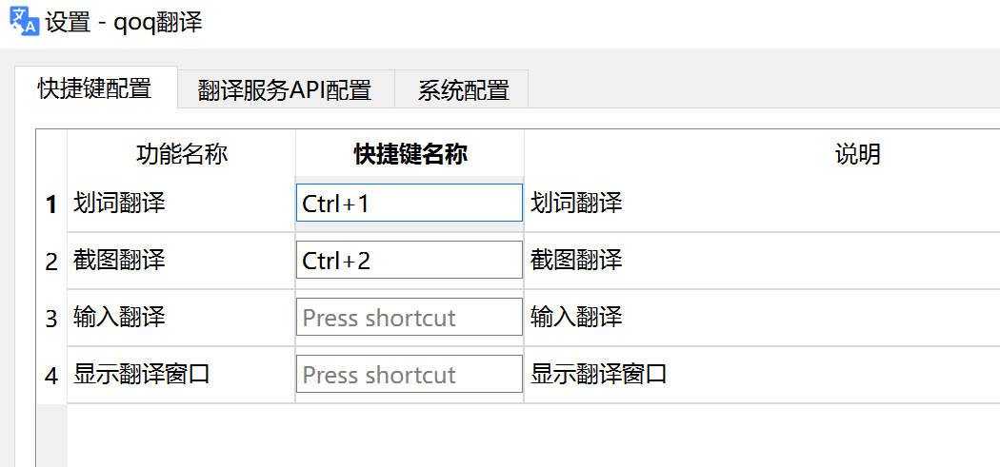

# qoq 是一款 Window 和 MacOS 翻译 OCR 软件

# [Window 最新版下载](https://github.com/duolabmeng6/qoq/releases)

# [Mac OS 最新版下载](https://github.com/duolabmeng6/qoq/releases](https://github.com/duolabmeng6/go-qoq) 
# Window 界面预览

# 支持快捷键

# 支持的翻译平台

* 支持各种翻译平台的api接入

* 内置从网上收集的免秘钥翻译接口

